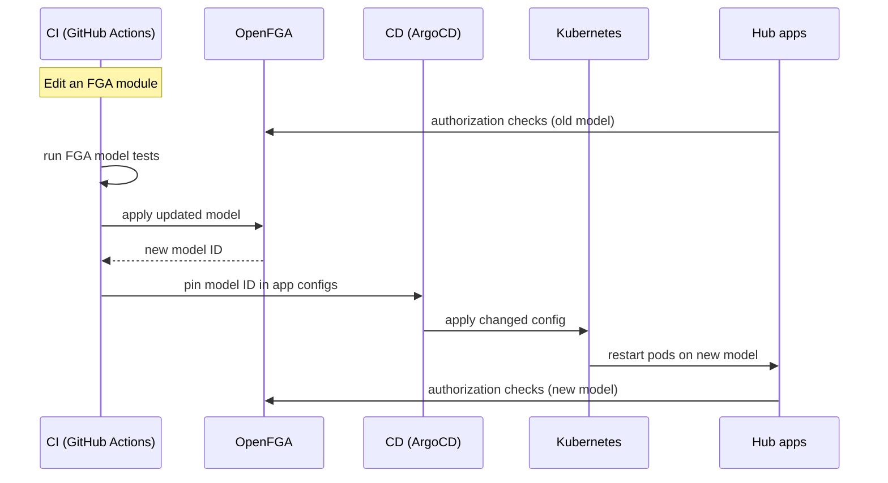

# FGA @ Kepler

---

## Summary

- Understand Kepler + AuthZ requirements
- Understand the use of OpenFGA at Kepler
- What we learned

Note:
- Kepler as a company and its unique authz requirements
- Understand the interesting ways we use it
- A bit of a war story and what we learned from it and how we remediated it.

---

### Leah Einhorn

Principal Software Engineer @ Kepler

Authentication & Authorization

---

## Kepler Group

A digital marketing agency.

---

### Kyu

Kepler is a part of **Kyu**, a global network of agencies, including BIMM, Sid Lee, and others.

---

## AuthZ @ Kepler

---

Because Kepler is an agency working with clients, we have strict access control requirements per client.

Note:
Clients may be direct competitors.

---

- In our core system, we used a PBAC (Policy-Based Access Control) model, similar to AWS IAM, which works well for isolating data per client.
- This requires a separate policy for every type of access requirement.
- This works well for our core system, where access is static and defined once per app and client.

---

### Kyu Hub

An new AI-powered platform designed for collaboration across Kyu companies.

Note:
- Hub is a relatively new system, deployed nimbly, and not yet exposed to clients.


---


- A platform where AI agents generate artifacts.
- Artifacts can be shared dynamically between users and work groups, and eventually across Kyu companies, for collaboration.
- User's access is determined by their relationship to the Kyu company, the client, and the resource.

---

This requires a fine-grained relationship-based access control model, rather than static policies. 

Note:
**This is where OpenFGA comes in!**

---

## Use Cases

Note:
Some of the unique and custom ways we use OpenFGA at Kepler.

---

### Multi-Org Users in Context

Users can operate across multiple Kyu companies, or orgs, such as Kepler and a sibling company.

We use a contextual tuple to ensure that the currently operating org is used for authorization checks.

---

#### How

- We leverage Auth0 Organizations, so that the user logs in to a specific organization
- The organization is injected into their token claims.

```json
{
  "sub": "john@keplergrp.com",
  "iss": "https://kepler.auth0.com/",
  "org_id": "kepler",
}
```

---

- Our system will extract it from the claims, and pass it into fga as a contextual tuple.

```python
await client.check(
    ClientCheckRequest(
        user="user:john",
        relation="can_access",
        object="artifact:1",
        contextual_tuples=[
          ClientTuple("user:john", "user_in_context", f"org:{org_id}"),
        ],
    )
)
```

Note:
Tests do not support contextual tuples yet.

---

### ~~List Objects~~ Filter then Batch Check

- Avoid using list operations, which are expensive.
- Instead, use the app database to list the resources first.

Note:
Initially we listed the objects in fga first, but requests were exceeding the default list limits.

---

#### How

- Filter on the user's resource, or by the resource's visibility (public vs. private, etc.).
- Use the filtered results to batch check access against fga.
- Limit the number of checks per batch checks via database pagination.


Note:
For example, an artifact can be private, or it can be shared with everyone working on the client team. Whether it's public / private is stored in the app database.
Once we query for that information, we then check fga to determine the user's relationship with the resource.

---


<!-- #### Staging -->

<!-- Every developer gets a personal staging environment, which is a dynamically spun-up copy of the whole app. --> 

<!-- --- -->

<!-- #### How -->

<!-- - Dynamically spin up a developer-specific fga store with the pre-requisite tuples --> 
<!-- - Assign the developer as the "admin" user of that store so they get full access to test their changes. -->

<!-- --- -->

### CI/CD

Hub is developed across multiple sub-apps. 

We split the fga model into **modules** per app. 

A change to any module rolls out to every FGA-consuming app.

Note:
The model is split into modules, one per sub-app, but they compose into a single model, so a change to any module changes the model, which must then be rolled out to every app.

---

#### How



Note:
- On PR, CI detects the FGA change and flags it.
- On deploy, the pipeline runs the setup script, which applies the model and bootstraps tuples against the live FGA service.
- FGA versions the model and the script outputs the new model ID.
- CI grabs that ID pins it into each app's configmap (using kustomize), then commits that to our config repo.
- This is where ArgoCD comes in: it watches that repo, and when it sees the changed config it applies it to the Kubernetes cluster.
- Kubernetes then restarts the pods so they use the new model, and every app resolves against the same version.

- **This allows us to also roll back to a previous version of the model if needed.**

---

### Checks are Comprehensive

Each check must answer whether the user has access to all pre-requisite checks.

Note:
For example, access to a resource must also require access to the overall app or feature that produced it.

---

#### How

Can access artifact + app + org

```rb
type artifact
  relations
    define app: [app]
    define org: [org]
    define owner: [user]
    define can_access: owner and can_access from app and can_access from org
```


```mermaid
flowchart TD
    A["can_access artifact:1"] --> B["owner?"]
    A --> C["can_access from app?"]
    A --> D["can_access from org?"]

---

## The Incident

Note: Let's talk about a time when the above principle contributed to an outage.

---

### Event

30 minutes after a routine model deploy, our fga service went down and couldn't come back up.

- Hub inaccessible to all users
- All FGA pods crashing
- Pods restarting in a loop

---

### Investigation

- Pods were exhausting all available DB connections
- Restart → instantly max out connections → crash

---

### State

- **Pods**: 3
- **DB Size**: Small
- **Configuration**: Default

---

```bash
DATASTORE_MAX_OPEN_CONNS               = 30
MAX_CONCURRENT_CHECKS_PER_BATCH_CHECK  = 50
MAX_CONCURRENT_READS_FOR_CHECK         = unlimited (MaxUint32)
CHECK_QUERY_CACHE_ENABLED              = false
```

_Version: 1.15.1_

Note:
Just to understand the current state:

We deployed nimbly to move fast; infra was provisioned to get it running, not for production load.

---

### Causal Chain

---

1. Deployed a more complex model, which increased the number of connections needed for a check.

---

#### Model

```rb
type org
  relations
    define admin: [user]
    define manager: [user]
    define member: [user] or admin or manager

type app
  relations
    define org: [org]
    define can_access: member from org

type artifact
  relations
    define app: [app]
    define org: [org]
    define owner: [user]
    define can_access: owner and member from org and can_access from app
```

Note:
`artifact.can_access` check is a nested AND, and member from org is a nested OR.

---

2. A BatchCheck fans out into many concurrent checks, all competing for the same pool.

---

#### Check

```python
items = [
    ClientBatchCheckItem(
        user="user:u1",
        relation="can_access",
        object=f"artifact:p{i}",
    )
    for i in range(1, 101)
]

async with OpenFgaClient(config) as client:
    await client.batch_check(ClientBatchCheckRequest(items))
```

---

#### Check Resolution

3. To resolve a relation, a check opens a connection and holds that connection open while it dispatches child checks to resolve the nested relations.

Note:
Each check therefore holds several connections at once (its own cursor plus every child it's waiting on).

---

4. The pool maxes out, and parent checks are stuck holding a connection while waiting on a child that can't get one.

Note:
Since we hadn't customized the configuration, it used the defaults.
```
MAX_OPEN_CONNS: 30
MAX_CONCURRENT_CHECKS_PER_BATCH_CHECK: 50
MAX_CONCURRENT_READS_FOR_CHECK: `math.MaxUint32` (unbounded)
```

---

5. The pool deadlocks.

Note:
At this point, checks fail since they time out by exceeding the request deadline.

---

6. Healthchecks fail.

    - Kubernetes healthcheck attempts to ping the DB.
    - Connections are maxed out.

Note:
In the meantime --

---

7. This causes Kubernetes to kill the unhealthy pods and restart it.

---

<div style="text-align: center; font-size: 3em">🔄</div>

Note:
The cycle repeats

---

## Remediation

---

### Infra

- Right-sized the DB: `t4g.small` → `t4g.medium`
- Raised max DB connections per pod

Note:
Larger DB instance gives us more connections, allowing us to raise the max db conns config.

---

### Config

- Stable pool: Set min idle / min open database connections
- Capped concurrent checks
- Enabled caching

```bash
DATASTORE_MIN_OPEN_CONNS
DATASTORE_MIN_IDLE_CONNS

MAX_CONCURRENT_READS_FOR_CHECK
MAX_CONCURRENT_CHECKS_PER_BATCH_CHECK

CHECK_QUERY_CACHE_ENABLED
CHECK_ITERATOR_CACHE_ENABLED
LIST_OBJECTS_ITERATOR_CACHE_ENABLED
```

Note:
Basically, follow fga best practices for production config.
The pool settings just keep connections warm.

---

### Model

- App access was re-checked for every object in a batch check
- Factored it out into a new relation that skips the app subtree
```diff
 type artifact
   relations
     define app: [app]
     define org: [org]
     define owner: [user]
-    define can_access: owner and member from org and can_access from app
+    define can_access_within_app: owner and member from org
```

---

- Check app access once per request, then batch the object checks

```python
async def can_access_artifacts():
    await client.check(
        ClientCheckRequest(
            user="user:john",
            relation="can_access",
            object="app:hub",
        )
    )

    await client.batch_check(
        ClientBatchCheckRequest(
            [
                ClientBatchCheckItem(
                    user="user:john",
                    relation="can_access_within_app",
                    object=f"artifact:{id_}",
                )
            ]
        )
    )
```

Note:
And of course, for any other repeated check branches across batch checks, the cache will absorb them.

---

### Minimal Reproduction

https://github.com/leahein/fga-max-conns

---

### Results

- Lower check latency
- Fewer DB connections per check / batch check
- Cache absorbing repeat checks

---

## Q&A
