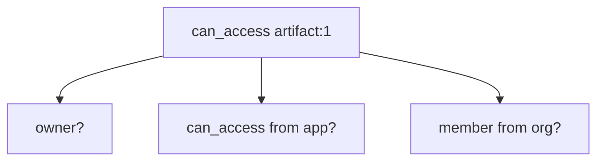
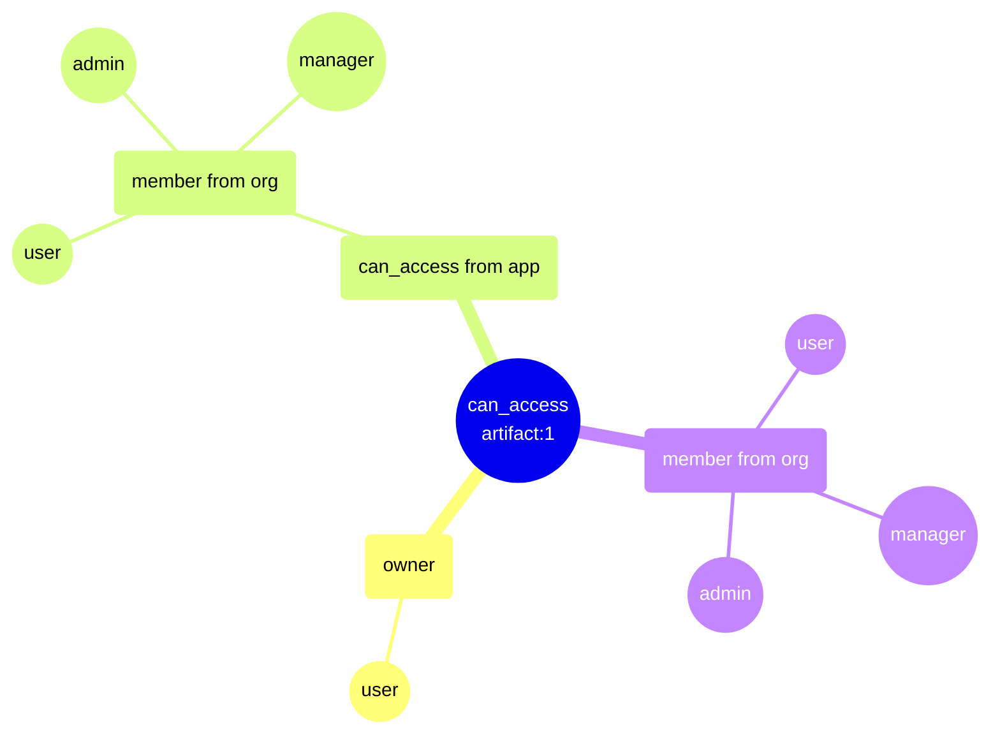
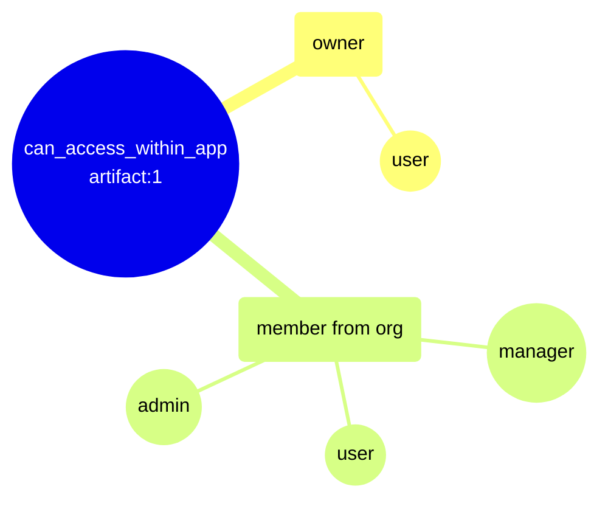
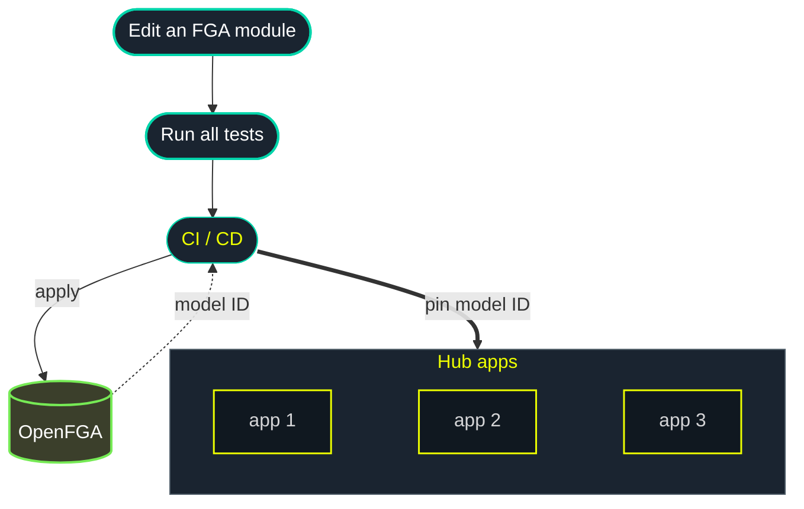
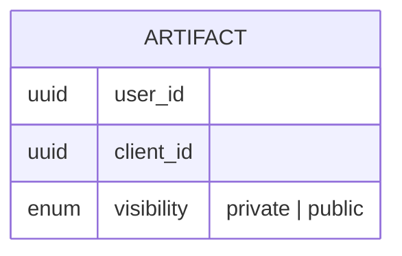

# FGA @ Kepler

---

## Summary

- Before OpenFGA
- Starting with OpenFGA
- Learnings from OpenFGA

Note:
- The context of Kepler AuthZ
- How we started with the defaults
- What we learned along the way

---

### Leah Einhorn

Principal Software Engineer @ Kepler

Authentication & Authorization

---

## Kepler Group

A digital marketing agency.

---

### kyu

Kepler is a part of **kyu**, a global network of agencies.

<div style="display: flex; align-items: center; justify-content: center; gap: 2em; margin-top: 1em;">
  
  
  
  
</div>

---

## AuthZ @ Kepler

### From Fixed to Flexible


---

Because Kepler is an agency working with clients, we have strict access control requirements per client.


Note:
Clients may be direct competitors.

---

- In our core system, we use PBAC (Policy-Based Access Control).
- A policy for every type of access requirement.

```json
{
  "Group": "client-admin",
  "Statement": [
    {
      "Action": ["advertisers-readAdvertisers"],
      "Effect": "Allow",
      "Resource": [
        "krn:kip:advertisers:kplr://advertiser/CLIENT-NAME/*",
      ]
    },
  ],
  "Version": "2020-09-25"
}
```

Note:
Similar to AWS IAM

---

- Access is static and defined once per app and client.
- This works well when isolating data per client.

---

### kyu Hub

An new AI-powered platform designed for collaboration across kyu companies.

---


- A platform where AI agents generate artifacts.
- Artifacts can be shared dynamically between users.
- User's access is determined by their relationship to the kyu company, the client, and the resource.

Note:
AuthZ needs are different

Shared between users and work groups, and eventually across kyu companies, for collaboration

---

This requires a fine-grained relationship-based access control model.

Note:
Rather than a static policy --

---

## OpenFGA

### From Defaults to Durability

Note:
At first, we started with a basic model and default deployment. Each one started with the simple, out-of-the-box approach, then evolved into something more deliberate. 

We learned a lot the hard way.


---

## Comprehensive Checks

Each check must answer whether the user has access to all pre-requisite checks.

Note:
For example, access to a resource must also require access to the overall app or feature that produced it.

---

### Then

Can access artifact + app + org

```rb
type artifact
  relations
    define app: [app]
    define org: [org]
    define owner: [user]
    define can_access: owner and can_access from app and member from org
```




Note:
Say a user owns an artifact. That's not enough.

**Why?** This is so that if a user is removed from an org / company or a client, we can simply remove one tuple relationship, that will cascade and remove access to all artifacts.

---

#### Deployment

- **Pods**: 3
- **DB Instance Size**: Small
- **Configuration**: Default

Note:
We then deployed this model.

We deployed nimbly to move fast; infra was provisioned to get it running, not for production load.

---

```bash
DATASTORE_MAX_OPEN_CONNS               = 30
MAX_CONCURRENT_CHECKS_PER_BATCH_CHECK  = 50
MAX_CONCURRENT_READS_FOR_CHECK         = unlimited (MaxUint32)
CHECK_QUERY_CACHE_ENABLED              = false
```

_Version: 1.15.1_

Note:
Starting with these defaults, this caused an outage.

---

#### Event

30 minutes after a routine model deploy, our FGA service went down and couldn't come back up.

- Hub inaccessible to all users
- All FGA pods crashing
- Pods restarting in a loop

---

#### Investigation

- Pods were exhausting all available DB connections
- Max out connections → crash -> restart

---

#### Causal Chain

---

1. Deployed a more complex model, which increased the number of connections needed for a check.

---

#### Model

```rb
type org
  relations
    define admin: [user]
    define manager: [user]
    define member: [user] or admin or manager

type app
  relations
    define org: [org]
    define can_access: member from org

type artifact
  relations
    define app: [app]
    define org: [org]
    define owner: [user]
    define can_access: owner and can_access from app and member from org 
```

Note:
`artifact.can_access` check is a nested AND, and member from org is a nested OR.

---

#### Fan-Out



Note:
One check fans out into the owner check plus two org-membership subtrees (one via app, one direct), each an OR over user/admin/manager. 

Every branch is a separate read holding a connection.

---

2. A Batch Check fans out into many concurrent checks, all competing for the same pool.

---

#### Check

```python
items = [
    ClientBatchCheckItem(
        user="user:u1",
        relation="can_access",
        object=f"artifact:p{i}",
    )
    for i in range(1, 101)
]

async with OpenFgaClient(config) as client:
    await client.batch_check(ClientBatchCheckRequest(items))
```

---

<!-- .slide: class="mindmap-small" -->


Note:
Happening 100 times.

---

#### Check Resolution

3. To resolve a relation, a check opens a connection and holds that connection open while it dispatches child checks to resolve the nested relations.

Note:
Each check therefore holds several connections at once (its own cursor plus every child it's waiting on).

---

4. The pool maxes out, and parent checks are stuck holding a connection while waiting on a child that can't get one.

Note:
Since we hadn't customized the configuration, it used the defaults.
```
MAX_OPEN_CONNS: 30
MAX_CONCURRENT_CHECKS_PER_BATCH_CHECK: 50
MAX_CONCURRENT_READS_FOR_CHECK: `math.MaxUint32` (unbounded)
```

---

5. The pool deadlocks.

Note:
At this point, checks fail since they time out by exceeding the request deadline.

---

#### Healthchecks

6. Healthchecks fail.

    - Healthcheck attempts to ping the DB.
    - Connections are maxed out.

Note:
In the meantime --

---

7. This causes Kubernetes to kill the unhealthy pods and restart it.

---

<div style="text-align: center; font-size: 3em">🔄</div>

Note:
The cycle repeats

---

### Now

---

#### Infra

- Right-sized the DB: `t4g.small` → `t4g.medium`
- Raised max DB connections per pod

Note:
Larger DB instance gives us more connections, allowing us to raise the max db conns config.

---

#### Config

- Stable pool: Set min idle / min open database connections
- Capped concurrent checks
- Enabled caching

```bash
DATASTORE_MIN_OPEN_CONNS
DATASTORE_MIN_IDLE_CONNS

MAX_CONCURRENT_READS_FOR_CHECK
MAX_CONCURRENT_CHECKS_PER_BATCH_CHECK

CHECK_QUERY_CACHE_ENABLED
CHECK_ITERATOR_CACHE_ENABLED
LIST_OBJECTS_ITERATOR_CACHE_ENABLED
```

Note:
Basically, follow FGA best practices for production config.
The pool settings just keep connections warm.

---

#### Model

- App access was re-checked for every object in a batch check
- Factored it out into a new relation that skips the app subtree
```diff
 type artifact
   relations
     define app: [app]
     define org: [org]
     define owner: [user]
-    define can_access: owner and member from org and can_access from app
+    define can_access_within_app: owner and member from org
```

---

#### Fan-Out: Optimized



---

- Check app access once per request, then batch the object checks

```python
async def can_access_artifacts():
    await client.check(
        ClientCheckRequest(
            user="user:john",
            relation="can_access",
            object="app:hub",
        )
    )

    await client.batch_check(
        ClientBatchCheckRequest(
            [
                ClientBatchCheckItem(
                    user="user:john",
                    relation="can_access_within_app",
                    object=f"artifact:{id_}",
                )
            ]
        )
    )
```

Note:
We do a 1-time check if you can access the app, instead of checking it for every artifact.
And of course, for any other repeated check branches across batch checks, the cache will absorb them.

---

#### Minimal Reproduction

https://github.com/leahein/fga-max-conns

---

#### Results

- Lower check latency
- Fewer DB connections per check / batch check
- Cache absorbing repeat checks

---

## Modular Model

Separate modules per app.

Note:
As the app grew, the next thing we evolved to...

---

### Then

A single monolithic app and FGA model.

Note:
Originally we started out with 1 big model, but as the app grew, we started to develop it across multiple sub-apps and it became difficult to manage.

---

### Now

- Each app has its own FGA **module**.

- A change to any module rolls out to every FGA-consuming app.

Note:
The model is split into modules, one per sub-app, but they compose into a single model, so a change to any module changes the model, which must then be rolled out to every app.

---



Note:
- On PR, CI detects the FGA change and flags it.
- We first run tests against all apps to make sure a change doesn't break any app.
- On deploy, the pipeline applies the model against the live FGA service.
- FGA versions the model and the script outputs the new model ID.
- CI grabs that ID and pushes the model ID out to all apps.

- **This allows us to also roll back to a previous version of the model if needed.**

---

### Results

- Each app manages its own FGA domain.
- A change in one module gets tested against all apps.
- The new model is rolled out to all apps.

---

## ~~List -> Search~~ Search -> Batch Check

Avoid list operations in FGA.

Search the database, then batch check against FGA.

Note:
The next thing we learned.
These are expensive

---

### Then

- List objects in FGA.
- Filter in the app database.

Note:
Iniitially, to display all user artifacts, we listed the objects in FGA first, because the total number of objects user can access is low. But as the user's artifacts grew, we ran into the list deadline / max results limits on fga, and had to work around them.

---

### Now

1. Pre-filter on data we have in the app database.

2. Batch check access against FGA.

3. Use database pagination + infinite scroll to limit the number of checks per batch checks.

Note:
We switched that, so we pre-filter on data we already have in the database, which then narrows down the number of objects.

To further narrow it down...

---

<!-- .slide: class="er-large" -->



Note:
Filter on the user's resource, the client, and the resource's visibility (public vs. private, etc.).
  - For example, an artifact can be private, or it can be shared with everyone working on the client team.
  - The visibility of whether it's public / private is stored in the app database.
  - We query for both the user's artifacts and the public artifacts  for the client (then batch check the filtered results against FGA).

---

### Results

- No management of list limits in FGA.
- Pagination keeps the batch check size manageable.

Note:
Infinite scroll has no fixed page count, so post-check drops are a non-issue.

---

Note:
Overall, these improvements and patterns have gotten us to a stable and maintainable authorization system...for now.

---

## Q&A
