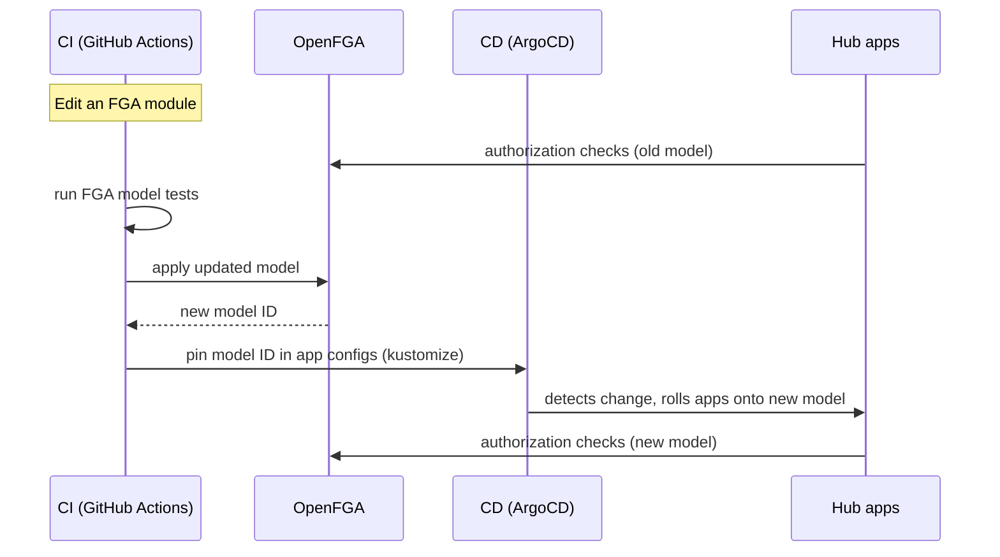

# FGA @ Kepler

---

## Summary

Understand the use of OpenFGA at Kepler.

Note:
- Where we use it
- Why we use it
- How we use it
- What we learned from using it

---

## Kepler Group

A digital marketing agency.

---

### Kyu

Kepler is a part of **Kyu**, a global network of agencies, including BIMM, Sid Lee, and others.

---

## AuthZ @ Kepler

---

Because Kepler is an agency working with clients, we have strict access control requirements per client.

---

- In our core system, we used a PBAC (Policy-Based Access Control) model, similar to AWS IAM, which worked well for isolating data per client.
- This requires a separate policy for every type of access requirement.
- This works well for our core system, where access is static and defined once per app and client.

---

### Kyu Hub

An new AI-powered platform designed for collaboration across Kyu companies.

Note:
- Hub is a relatively new system, deployed nimbly, and not yet exposed to clients.


---


- A platform where AI agents generate artifacts.
- Artifacts can be shared dynamically between users and work groups, and eventually across Kyu companies, for collaboration.
- User's access is determined by their relationship to the Kyu company, the client, and the resource. Resources can also be published and shared more broadly.

---

This requires a fine-grainted relationship-based access control model, rather than static policies.

---

### Why OpenFGA

Note:
We evaluated several different tools, and chose OpenFGA for the following.

---

#### **Solid Feature Set**

Complex model expressiveness, wildcard / public access,  caching, and datastore flexibility.

---

#### **Strong Developer Experience** 

Excellent documentation with many examples and best practices, easy docker setup, and good tooling (local playground, CLI).

---
#### **Auth0 Alignment**

OpenFGA is backed by Auth0, which Kepler already uses for authentication, simplifying vendor management.

---

#### **Flexibility**

It offers a solid open-source offering and licence (Apache 2.0 license) for self-hosting, plus a managed option, giving us the flexibility to transition as our needs evolve.

---

#### **Active Community**

A CNCF project with an active Slack channel and responsive maintainers.

---

## Use Cases

Note:
Some of the unique and custom ways we use OpenFGA at Kepler.

---

### Multi-Org Users in Context

Users can operate across multiople Kyu companies (orgs), such as Kepler and a sibling company.

We use a contextual tuple to ensure that the currently operating org is used for authorization checks.

---

#### How

- We leverage Auth0 Organizations, so that the user logs in to a specific organization
- The organization is injected into their token claims.
- Our system will extract it from the claims, and pass it into fga as a contextual tuple.
- Note: Tests do not support contextual tuples yet.

Note:
- This ensures we always use the correct organization context for authorization checks, even if the user is a member of multiple organizations.

---

### ~~ListObjects~~ Filter then Batch Check

- Avoid using list operations
- Instead, use the app database to list the resources first.

---

#### How

- Filter on the user's resource, or by the resource's visibility (public vs. private, etc.).
- Use the filtered results to batch check resource access for the user.
- Pagination via infinite scroll allows us to limit the number of batch checks per request.


Note:
For example, an artifact can be private, or it can be shared with everyone working on the client team. Whether it's public / private is stored in the app database.
Once we query for that information, we then check fga to determine the user's relationship with the resource.

---


### CI/CD

---

#### Staging

Every developer gets a personal staging environment, which is a dynamically spun-up copy of the whole app. 

---

#### How

- Dynamically spin up a developer-specific fga store with the pre-requisite tuples 
- Assign the developer as the "admin" user of that store so they get full access to test their changes.

---

#### Production

Hub is split into multiple apps. 

We split the fga model into **modules** per app. 

A change to any module rolls out to every FGA-consuming app.

---

#### How



Note:
The model is split into modules, one per sub-app, but they compose into a single model, so a change to any module recomposes the whole thing. On PR, CI detects the FGA change and flags it. On deploy, the pipeline runs the setup script, which applies the model and bootstraps tuples against the live FGA service. FGA versions the model and the script outputs the new model ID. CI grabs that ID and uses kustomize to pin it into each app's configmap, then commits that to our config repo. This is where ArgoCD comes in: it watches that repo, and when it sees the changed config it syncs the cluster and rolls the apps onto the new model, so every app resolves against the same version. 

This allows us to also roll back to a previous version of the model if needed.

---

### Checks are Comprehensive

Each check must answer whether the user has access to all pre-requisite checks.

Note:
For example, access to a resource must also require access to the overall app or feature that produced it.

---

#### How

**Example**: Can access artifact + app + client

```rb
type artifact
  relations
    define app: [app]
    define client: [client]
    define owner: [user]
    define can_read: owner and can_access from app and can_access from client

---

## The Incident

Note: Let's talk about a time when the above principle contributed to an outage.

---

30 minutes after a routine model deploy, our fga service went down and couldn't come back up.

---

### Event

- Hub inaccessible to all users
- All FGA pods crashing
- Pods restarting in a loop

---

### Background

- **Pods**: 3
- **DB Size**: Small
- **Configuration**: Default

```bash
DATASTORE_MAX_OPEN_CONNS               = 30
MAX_CONCURRENT_CHECKS_PER_BATCH_CHECK  = 50
MAX_CONCURRENT_READS_FOR_CHECK         = unlimited (MaxUint32)
CHECK_QUERY_CACHE_ENABLED              = false
```

_Version: 1.15.1_

Note:
Hub is a young, pre-client beta. We deployed nimbly to move fast; infra was provisioned to get it running, not for production load.

---

### Investigation

- Pods were exhausting all available DB connections
- Restart → instantly max out connections → crash → loop

---

### Causal Chain

---

1. Deployed a more complex model, which increased the number of connections needed for a check.

---

#### Model

```rb
type user

type org
  relations
    define member: [user]
    define user_in_context: [user]

type app
  relations
    define org: [org]
    define can_access: member from org and user_in_context from org

type product
  relations
    define app: [app]
    define org: [org]
    define can_access: member from org and user_in_context from org and can_access from app
```

TODO: Update product to artifact

Note:
`product.can_access` check is a nested AND

---

2. A BatchCheck fanned out into many concurrent checks, all competing for the same pool.

---

#### Check

```python
items = [
    ClientBatchCheckItem(
        user="user:u1",
        relation="can_access",
        object=f"product:p{i}",
        contextual_tuples=[
            ClientTuple("user:u1", "user_in_context", "org:o1")
        ],
    )
    for i in range(1, 101)
]

async with OpenFgaClient(config) as client:
    await client.batch_check(ClientBatchCheckRequest(items))
```

---

#### Check Resolution

3. To resolve a relation, a check opens a DB cursor to read tuples, and holds that connection open while it dispatches child checks to resolve the nested relations.

A parent check keeps its connection reserved while blocked on children that each need their own connection from the same pool.

Note:
Each check therefore holds several connections at once (its own cursor plus every child it's waiting on).

---

4. The pool empties, and checks are stuck holding a connection while waiting on a child that can't get one.

Note:
Since we hadn't customized the configuration, it used the defaults.
```
MAX_OPEN_CONNS: 30
MAX_CONCURRENT_CHECKS_PER_BATCH_CHECK: 50
MAX_CONCURRENT_READS_FOR_CHECK: `math.MaxUint32` (unbounded)
```

---

5. The pool deadlocks.

Note:
At this point, checks fail since they time out by exceeding the request deadline.

---

6. Kubernetes healthcheck pinged the DB, couldn't get a connection, and failed.

---

7. A failing healtcheck caused Kubernetes to kill the unhealthy pods and restart it.

---

The cycle repeats.

---

## Remediation

---

### Infra

- Right-sized the DB: `t4g.small` → `t4g.medium`
- Raised max DB connections per pod

---

### Config

- Stable pool: Set min idle / min open database connections
- Capped concurrent checks
- Enabled caching

```bash
DATASTORE_MIN_OPEN_CONNS
DATASTORE_MIN_IDLE_CONNS
MAX_CONCURRENT_READS_FOR_CHECK
MAX_CONCURRENT_CHECKS_PER_BATCH_CHECK
CHECK_QUERY_CACHE_ENABLED
```

Note:
Basically, follow fga best practices for production config.
The pool settings just keep connections warm.

---

### Model

- App access was re-checked for every resource in a batch check
- Factored it out into a new relation that skips the app subtree
- Check app access once per request, then batch the resource checks

Fewer nested checks, fewer connections.

---

### Model

```diff
 type product
   relations
     define app: [app]
     define org: [org]
-    define can_access: member from org and user_in_context from org and can_access from app
+    define can_access_within_app: member from org and user_in_context from org
```

---

### Result

- Lower check latency
- Fewer DB connections per check / batch check
- Cache absorbing repeat checks

---

## Q&A
