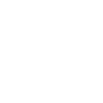
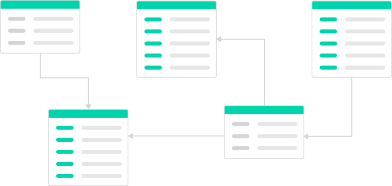
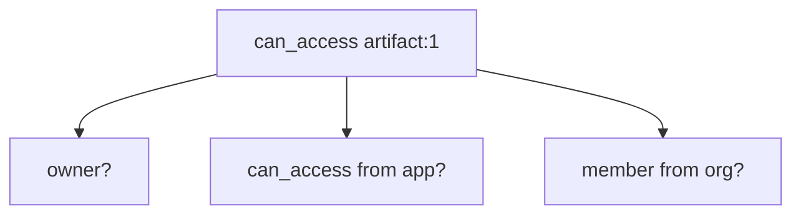
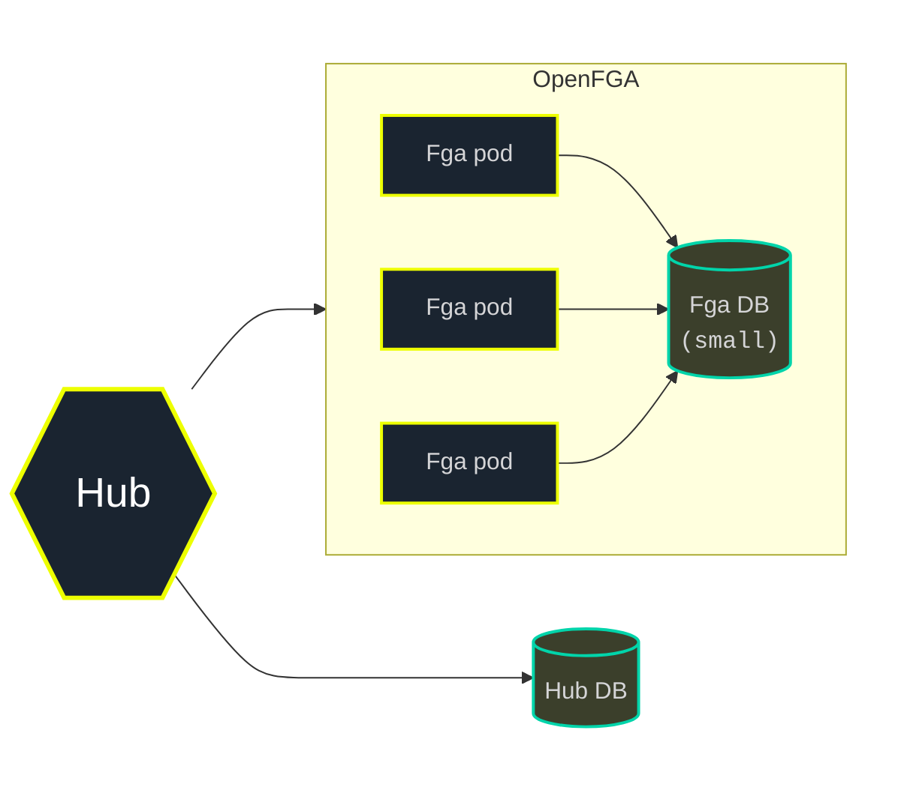
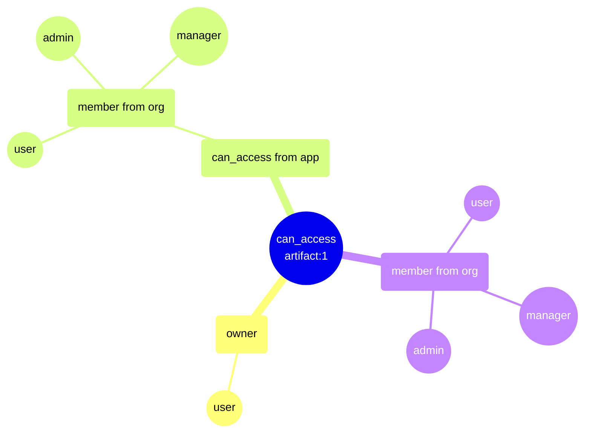
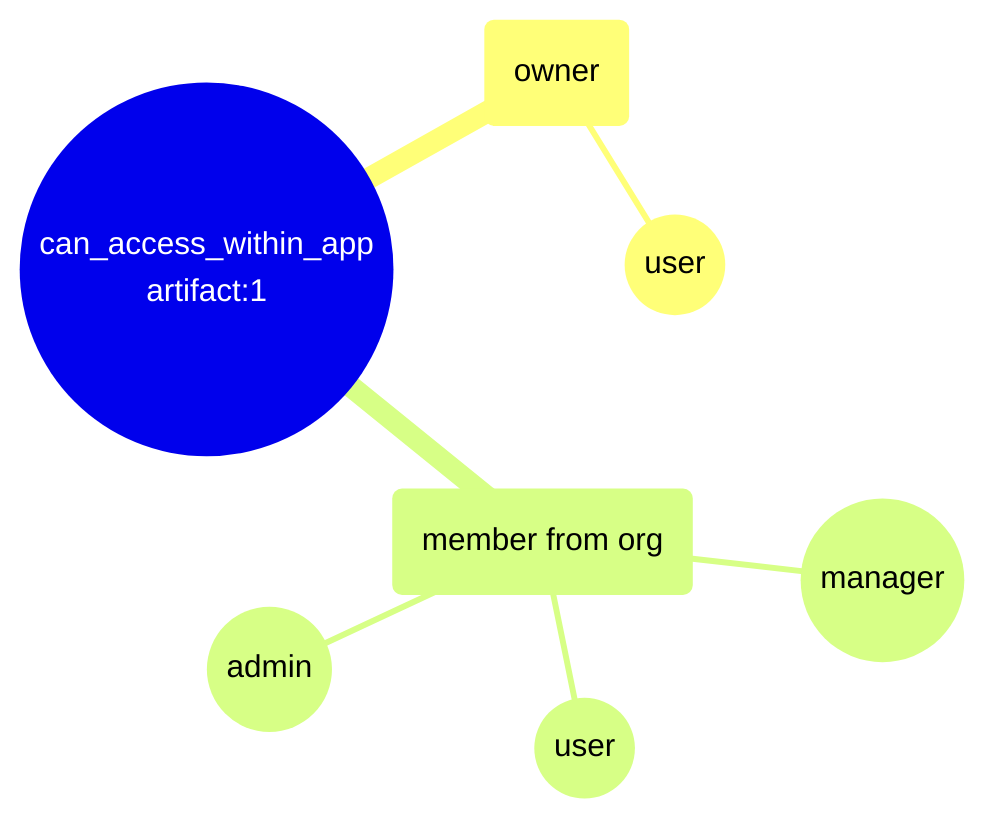
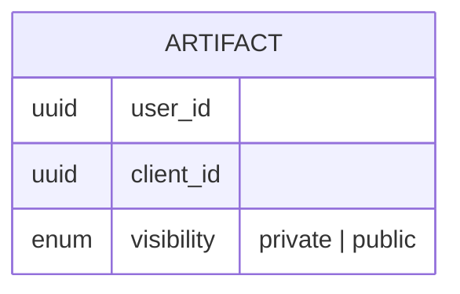

# OpenFGA @ Kepler

---

### Leah Einhorn


Principal Software Engineer<br />
_Authentication & Authorization_

<p class="contact">
  <br />
  <a href="https://www.linkedin.com/in/leaheinhorn/">linkedin.com/in/leaheinhorn</a>
</p>

---

## Summary

- About Kepler
- Why OpenFGA
- From Simple to Scalable

Note:
- The context of Kepler
- Why we use OpenFGA
- The 3 ways in which we started out simple and how we evolved to a more scalable solution.

---

<!-- .slide: class="logo-title" -->




Note:
A digital marketing agency

Serving Fortune 500 clients

---

<div style="display: flex; align-items: center; justify-content: center; gap: 2em; margin-top: 1em;">
  
  
  
  
</div>

Note:
Kepler is a part of **kyu**, a global collection of agencies

---

## AuthZ @ Kepler

<!-- ### From Fixed to Flexible -->


---

Kepler has strict access control requirements


Note:
Because Kepler is an agency working with clients, and clients may be direct competitors, we have strict access control requirements per client.

---

In our core system we use **Policy-Based Access Control** (PBAC)

```json
{
  "Group": "client-admin",
  "Action": ["advertisers-readAdvertisers"],
  "Effect": "Allow",
  "Resource": ["krn:...:advertiser/CLIENT-NAME/*"]
}
```

- Policies are static and defined once per app and client

Note:

Similar to AWS IAM.

This works well in our core system, where a defined set of static policies can isolate client data.

---

### kyu Hub

A new AI-powered platform designed for collaboration across kyu companies

Note:
A platform where AI agents generate artifacts

---

Artifacts can be shared dynamically between users




Note:
**AuthZ needs are different**

- User's access is determined by their relationship to the kyu company, the client, or the resource

Which takes us to...

---

## OpenFGA @ Kepler

Note:
Which allows us to achieve **fine-grained relationship-based access control model** in a dynamic way that isn't possible with static policies.

---

### From Simple to Scalable


Note:
Now, originally we deployed Hub and openfga nimbly, to move fast and get the app up and running; not for production load. 

As the app grew, we ran into a few issues, including an outage.

So we'll talk about 3 different scenarios for how we started out simply, and what we learned in order to ensure we can scale in the future.


---

## 1. Unbounded -> Controlled Fan-Out

Manage comprehensive checks effectively.

---

### Then

Each check must also include all pre-requisite checks

Note:
**It's not enough to have access to the resource.**

---

Can access `artifact` + `app` + `org`




- Removing a single relationship cascades to all artifacts

Note:
Say a user owns an artifact. That's not enough.

- Are they owner of the artifact 
- AND access to the app that produced it 
- AND are they a member from the org **aka company**?

**Why?** This is so that:

1. if a user is removed as a member of an org, for example
2. we can simply remove one tuple relationship
3. that will cascade and **remove access to all artifacts**.


---

```rb
type artifact
  relations
    define app: [app]
    define org: [org]
    define owner: [user]
    define can_access: owner and can_access from app and member from org
```

Note:
And this was fine... until we increased the complexity of the model to something such as this. 

After a routine deploy of such a model....


---

#### Outage

<div style="text-align: center; font-size: 3em">💥</div>

Note:
...our FGA service went down and couldn't come back up, causing an outage.

- Hub inaccessible to all users
- All FGA pods crashing
- And restarting in a loop

---

#### Investigation

OpenFGA was exhausting all DB connections

---

#### Causal Chain

---

##### System

<!-- .slide: class="deployment-diagram" -->



Note:
First, let's understand the state of our system at the time.

- 3 OpenFGA pods
- Small Postgres database instance

---

##### Default Configuration

```bash
DATASTORE_MAX_OPEN_CONNS               = 30
MAX_CONCURRENT_CHECKS_PER_BATCH_CHECK  = 50
MAX_CONCURRENT_READS_FOR_CHECK         = unlimited (MaxUint32)
CHECK_QUERY_CACHE_ENABLED              = false
```

_Version: 1.15.1_

Note:
Default OpenFGA configuration

---


1. A more complex model increased the number of connections needed to resolve a check

Note:
So the more complex model...

---

#### Model

```rb
type org
  relations
    define admin: [user]
    define manager: [user]
    define member: [user] or admin or manager

type app
  relations
    define org: [org]
    define can_access: member from org

type artifact
  relations
    define app: [app]
    define org: [org]
    define owner: [user]
    define can_access: owner and can_access from app and member from org 
```

Note:
One check fans out into the owner check plus two org-membership subtrees (one via app, one direct), each an OR over user/admin/manager.

---

#### Fan-Out



Note:

**Each check requiring a database connection.**

---

2. A Batch Check fans out into many concurrent checks

Note:
**We weren't doing the check once, but in a batch check, of many concurrent checks.**

All of which are competing for the same pool.

---

#### Batch Check

```python
items = [
    ClientBatchCheckItem(
        user="user:u1",
        relation="can_access",
        object=f"artifact:p{i}",
    )
    for i in range(1, 101)
]

async with OpenFgaClient(config) as client:
    await client.batch_check(ClientBatchCheckRequest(items))
```

---

<!-- .slide: class="mindmap-small" -->


Note:
Happening 100 times.

---

#### Check Resolution

> To resolve a relation, a check opens a connection and holds that connection open while it dispatches child checks to resolve the nested relations.

Note:
Now we first need to understand how a check is resolved by OpenFGA.

_Each check therefore holds several connections at once (its own cursor plus every child it's waiting on)._

---

3. Parents are stuck waiting on child checks that can't get a connection

Note:
**But the pool is maxed out so...**

---

4. The pool deadlocks


Note:
At this point, checks can't resolve and start failing since they are exceeding the request deadline.

---

5. Healthchecks fail


Note:
In the meantime --

- Kubernetes is running healthchecks on the pods
- OpenFGA healthcheck attempts to ping the DB
- Connections are maxed out

---

6. Kubernetes kills the unhealthy pods and restarts it

Note:
This causes...

---

<div style="text-align: center; font-size: 3em">🔄</div>

Note:
The cycle repeats

---

### Now

Note:
So what did we do to correct this.

---

#### Infra

- Right-sized the DB: `t4g.small` → `t4g.medium`
- Raised max DB connections per pod

Note:
Larger DB instance gives us more connections, allowing us to raise the max db conns config.

---

#### Config

- Stable pool: Set min idle / open connections
- Capped concurrent checks
- Enabled caching

```bash
DATASTORE_MIN_OPEN_CONNS
DATASTORE_MIN_IDLE_CONNS

MAX_CONCURRENT_READS_FOR_CHECK
MAX_CONCURRENT_CHECKS_PER_BATCH_CHECK

CHECK_QUERY_CACHE_ENABLED
CHECK_ITERATOR_CACHE_ENABLED
LIST_OBJECTS_ITERATOR_CACHE_ENABLED
```

Note:
Basically, follow FGA best practices for production config.

The pool settings just keep connections warm.

---

#### Model

- Previously, app access was re-checked for every item in a batch check
- Factored out into a new relation that skips the app subtree

```diff
 type artifact
   relations
     define app: [app]
     define org: [org]
     define owner: [user]
-    define can_access: owner and can_access from app and member from org
+    define can_access_within_app: owner and member from org
```

Note:
So say a batch check contains 100 artifacts, we would **check the same app access, 100 times**.

---

#### Fan-Out: Optimized



---

Instead, check app access once per request

```python
async def can_access_artifacts():
    await client.check(
        ClientCheckRequest(
            user="user:john",
            relation="can_access",
            object="app:hub",
        )
    )

    await client.batch_check(
        ClientBatchCheckRequest(
            [
                ClientBatchCheckItem(
                    user="user:john",
                    relation="can_access_within_app",
                    object=f"artifact:{id}",
                ),
                ...
            ]
        )
    )
```

Note:
We **still** do a 1-time check if you can access the app, instead of checking it for every artifact. Then batch check the artifacts with the new relation.

_And of course, for any other repeated check branches across batch checks, the cache will absorb them._

---

#### Minimal Reproduction

https://github.com/leahein/fga-max-conns

---

#### Results

- Lower check latency
- Fewer DB connections per check / batch check
- Cache absorbing repeat checks

---

## 2. List & Search -> Search & Batch Check

Avoid list operations in FGA

Note:
The next thing we learned, in a bit less of an exciting way, is that

**List** is expensive. Avoid for large result sets.

---

### Then

1. List objects in FGA
2. Filter IDs in the app database

Note:
Initially, because the total number of user artifacts was low,

- We used FGA to **first** list the artifacts the user has access to.
- Then use IDs to filter the artifacts in the app database.

---

List results are truncated


Note:
But as the user's artifacts grew, we ran into OpenFGA list limits with

- **list deadline limit**
- **max results limits**

So artifacts would be truncated.

Had to work around them.

---

### Now

1. **First** filter on data in the app database to narrow down objects

<!-- .slide: class="er-large" -->



Note:
**This narrows down the number of objects.**


- It's not enough to filter on the user's artifacts.
- Because an artifact can also be shared with everyone working on the client.
- So the visibility of whether it's public / private is stored in the app database.
- We query for both the user's artifacts and the public artifacts for the client.

---

2. **Then** batch check access against OpenFGA

Note:
...essentially reversing the order.

---

Use database pagination to reduce the number of items per batch checks

Note:
To further narrow it down...

..to limit the number of artifacts fetched from our app database, reducing the number of items to check per batch check request.

---

### Results

- No management of FGA list limits
- Pagination keeps the batch check size manageable

Note:
__The tradeoff to this approach is that we tie the app database model to what the user has access to, but...__

_Infinite scroll has no fixed page count, so post-check drops are a non-issue._

---

## 3. 1 Model -> Modular Model

Separate modules per app

Note:
Finally, the last way in which we evolved and set ourselves up for expansion.
Is that as the app grew...

---

### Then

A single monolithic app and OpenFGA model

Note:
Originally we started out with 1 big model. 

---

Multiple apps and teams sharing 1 model


Note:
But as the app grew, we started to develop Hub across multiple sub-apps and the model became difficult to manage across teams.

---

### Now

- Each app has a corresponding FGA **module**

- A change to any module rolls out to every FGA-consuming app

Note:
The model is split into modules, one per sub-app. 

Since they compose into a single model, a change to any module changes the model, so they must then be rolled out to every app.

---


Note:
- When an update is made to an FGA module,
- We first run tests against all apps to make sure a change doesn't break any app.
- On deploy, the pipeline applies the model against the live FGA service.
- FGA versions the model and the script outputs the new model ID.
- CI grabs that ID and pushes the model ID out to all apps.

---

### Results

- Each app handles its own FGA domain
- The new model is rolled out to all apps

---

## Takeaways

1. **Control Fan-out**
2. **Avoid List Operations**
3. **Use Modules**

Note:
- Control fan-out with our config and model design
- Avoid list operations for large result sets, when we can
- As the app grows, use modules to separate concerns

Overall, these improvements have gotten us to a stable and maintainable authorization system...for now.

---

## Q&A
